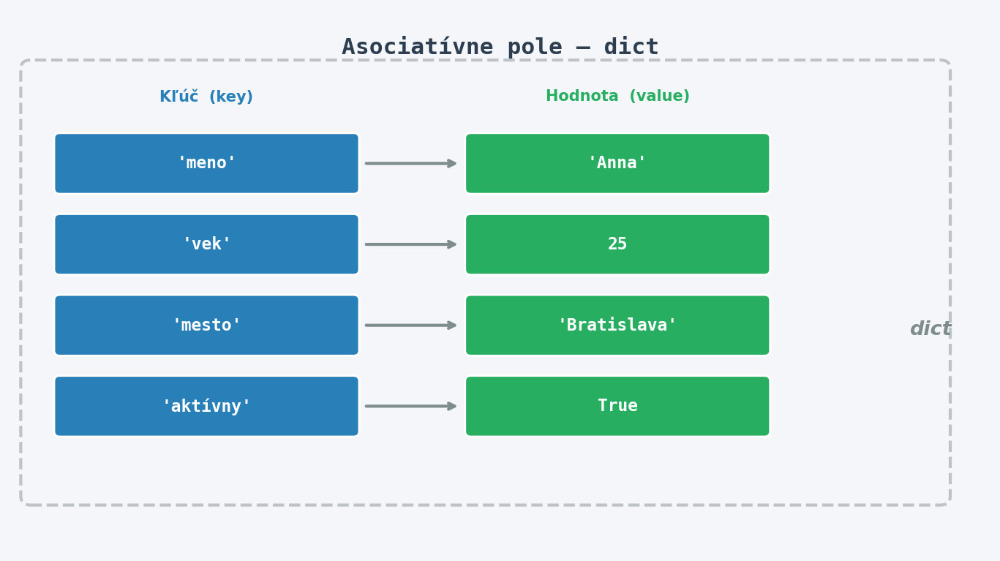

Slovník (`dict`) je dátová štruktúra, ktorá uchováva **páry kľúč-hodnota** (*key-value pairs*). Každý kľúč je unikátny a slúži ako adresa, pomocou ktorej vyhľadáme príslušnú hodnotu - podobne ako v skutočnom slovníku alebo telefónnom zozname.

{width=75%}

## Môj prvý slovník

Vytvor slovník `osoba`, ktorý bude obsahovať informácie o jednej osobe: meno (`"meno"`), vek (`"vek"`) a obľúbené mesto (`"mesto"`). Vypíš:

1. Celý slovník.
2. Hodnotu kľúča `"meno"` - použi zápis `osoba["meno"]`.
3. Hodnotu kľúča `"vek"` - použi metódu `.get("vek")`.
4. Hodnotu kľúča `"email"` pomocou `.get("email", "neznámy")` - čo sa stane?

> **Tip**: `.get(kľúč, predvolená_hodnota)` vráti predvolenú hodnotu namiesto chyby, keď kľúč neexistuje.

## Nákupný košík

Vytvor slovník `kosik`, v ktorom sú uložené názvy potravín (kľúče) a ich ceny v eurách (hodnoty):

```
jablko -> 0.30 €,  chlieb -> 1.20 €,  mlieko -> 0.89 €
```

Vykonaj nasledujúce operácie a po každej vypíš aktuálny obsah košíka:

1. Pridaj položku `"maslo"` za cenu `1.50 €`.
2. Zmeň cenu `"mlieka"` na `0.99 €`.
3. Odober `"jablko"` z košíka (použi `.pop()`).
4. Vypočítaj a vypíš celkovú sumu nákupu\footnote{Tip: použi \texttt{sum(kosik.values())}.}.

## Trieda

Máš slovník `znamky` - každý kľúč je meno žiaka a hodnota je jeho priemerná známka (číslo od 1.0 do 5.0, kde 1.0 je najlepšia):

```python
znamky = {"Anna": 1.5, "Boris": 2.8, "Cyril": 3.2, "Dana": 1.2, "Emil": 4.0}
```

Napíš program, ktorý:

1. Vypíš známku Anny.
2. Zisti a vypíš, koľko žiakov má priemernú známku lepšiu ako `2.5`.
3. Nájdi a vypíš meno žiaka s **najlepšou** (najnižšou) priemernou známkou.

> **Otázka**: Dalo by sa nájsť najlepšieho žiaka bez manuálneho prechádzania celého slovníka? (*Hint:* `min(znamky, key=znamky.get)`)

## Kontaktná kniha

Vytvor program, ktorý simuluje jednoduchú kontaktnú knihu. Začni s prázdnym slovníkom `kontakty`. Program musí postupne:

1. Pridať kontakty: `"Anna" -> "0901 123 456"`, `"Boris" -> "0902 654 321"`, `"Cyril" -> "0903 111 222"`.
2. Overiť, či kontakt `"Dana"` existuje - použi operátor `in`.
3. Aktualizovať číslo `"Borisa"` na `"0902 999 888"`.
4. Odstrániť kontakt `"Cyril"`.
5. Vypíš všetky kontakty - každý na nový riadok vo formáte `Meno: číslo`.

## Frekvencia písmen

Napíš funkciu `frekvencia(retazec)`, ktorá dostane reťazec a vráti slovník, kde každý kľúč je písmeno a hodnota udáva, koľkokrát sa toto písmeno v reťazci nachádza.

**Príklad:**

```
frekvencia("abcda") -> {"a": 2, "b": 1, "c": 1, "d": 1}
```

> **Tip**: Prechádzaj cez reťazec znak po znaku. Ak kľúč ešte neexistuje, nastav jeho hodnotu na `1`; inak ju zvýš o `1`. Môžeš využiť `.get(znak, 0)`.

*Bonus*: Uprav funkciu tak, aby ignorovala medzery a nerozlišovala veľké/malé písmená.

## Leaderboard

Po skončení hry máš nasledovné skóre hráčov:

```python
skore = {"Alice": 4200, "Bob": 3750, "Charlie": 5100, "Diana": 4800, "Eve": 3200}
```

Napíš program, ktorý:

1. Vypíš všetkých hráčov a ich skóre pomocou `.items()` - každého na nový riadok.
2. Nájdi a vypíš meno **víťaza** (hráča s najvyšším skóre).
3. Vypočítaj a vypíš **priemerné skóre** všetkých hráčov.
4. Pridaj nového hráča `"Frank"` so skóre `4500` a znovu nájdi víťaza.

## Inventár skladu

Sklad obsahuje nasledovný inventár - **vnorený slovník**, kde každý produkt má počet kusov a cenu za kus:

```python
inventar = {
    "ceruzka":  {"pocet": 200, "cena": 0.15},
    "zosit":    {"pocet": 80,  "cena": 1.20},
    "pravitko": {"pocet": 45,  "cena": 0.80},
}
```

Napíš program, ktorý:

1. Vypíš celkový počet kusov každého produktu vo formáte `produkt: X ks`.
2. Vypočítaj celkovú hodnotu zásob pre každý produkt ($\text{pocet} \times \text{cena}$) a vypíš ju.
3. Pridaj nový produkt `"guma"` s $30$ kusmi za cenu `0.25 €`.
4. Aktualizuj počet `"ceruziek"` na `150` (predali sme $50$ kusov).

## Prekladač

Vytvor slovník `slovnik_en_sk`, ktorý obsahuje aspoň $8$ párov anglicko-slovenských slov (napr. `"dog" -> "pes"`, `"cat" -> "mačka"`, ...).

Napíš program, ktorý:

1. Vypýta od užívateľa anglické slovo a vypíše jeho slovenský preklad. Ak slovo neexistuje, vypíš `"Slovo sa nenašlo."`.
2. **Otočí** slovník - vytvorí nový slovník `slovnik_sk_en`, kde kľúče a hodnoty sú vymenené\footnote{Hint: použi cyklus alebo slovníkové comprehension: \texttt{\{v: k for k, v in slovnik.items()\}}.}.
3. Vypíš všetky slovenské slová (kľúče otočeného slovníka).

> **Otázka**: Čo sa stane, ak má viacero anglických slov rovnaký slovenský preklad pri otáčaní slovníka?

## Server API

Máš nasledovné dáta, ktoré simulujú odpoveď servera (rovnako ako funguje **JSON** v reálnych aplikáciách):

```python
data = {
    "server":      "AbInitio-01",
    "uptime":      864000,
    "onlineUsers": 42,
    "balance": {
        "user_1":  150,
        "user_2":  320,
        "user_3": -40,
    },
    "isServerUp": True,
}
```

Napíš program, ktorý:

1. Vypíš názov servera a čas behu (*uptime*) v dňoch\footnote{Uptime je v sekundách: $1\;\text{deň} = 86\,400\;\text{s}$.}.
2. Vypíš počet online používateľov.
3. Nájdi a vypíš meno **najbohatšieho** užívateľa (s najvyšším zostatkom).
4. Nájdi a vypíš meno **zadlženého** užívateľa (so záporným zostatkom).

## Štatistiky textu

Napíš funkciu `pocet_slov(text)`, ktorá dostane reťazec a vráti slovník, kde každý kľúč je slovo a hodnota je počet jeho výskytov v texte.

**Príklad:**

```
pocet_slov("pes pes mačka pes mačka")  ->  {"pes": 3, "mačka": 2}
```

Funkciu otestuj na nasledovnom texte:

```
"the quick brown fox jumps over the lazy dog the fox"
```

Následne vypíš:

1. Celkový počet **unikátnych** slov.
2. Slovo, ktoré sa vyskytuje **najčastejšie**.
3. Všetky slová, ktoré sa vyskytujú **práve raz**.

> **Tip**: Reťazec rozdelíš na slová metódou `.split()`. Nezabudni na `.lower()` pre jednotnosť.
