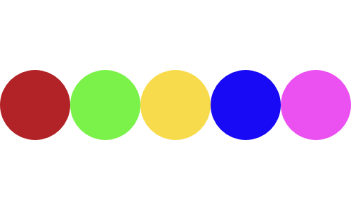
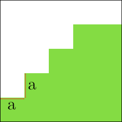
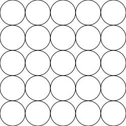

## Švédska vlajka

Vytvor program, ktorý nakreslí obrázok o rozmere `500x350` so [Švédskou vlajkou][swe-flag].
Použi farby: `#006AA7`, `#FECC02`.

[swe-flag]: https://upload.wikimedia.org/wikipedia/en/thumb/4/4c/Flag_of_Sweden.svg/1920px-Flag_of_Sweden.svg.png?20240819095330

## Krúžky

Vytvor program, ktorý vytvorí 5 po sebe idúcich krúžkov v jednej rovine, každý
inej farby. V tejto časti **nepouži** slučku. Výstup tvojho programu môže
vyzerať napr. takto:

## Krúžky 2.0

Ako si si určite všimol, v predošlej úlohe sme vytvorili obrázok ktorého časti sa
viac-menej stále opakujú. *Čo tak použiť už spomínanú slučku?* Tvojou úlohou je
teda program prepísať skrz slučku.

## Schodisko

Vytvor program, ktorý nakreslí obrázok o rozmere `250x250` podľa tohto náčrtu.
Ide o *schodisko*. Tvoje riešenie musí obsahovať *slučku* na vytvorenie každého
schodu.

> **Otázka**: Prečo je dobré použiť slučku? Tip: viď pokračovanie tohto cvičenia.

## Schodisko 2.0

V predošlej úlohe sme vytvorili schodisko. Nakoľko bol daný rozmer obrázka `250x250` a
je patrné, že máme $4$ schody (resp. $+1$ prázdny schod), tak šírka resp. výška
jedného schodu je $250 \div 5 = 50\;\text{px}$ (viď $a$ v obrázku). Tvojou
úlohou je program **vylepšiť**; v programe definuj premennú `pocet_schodov`
(túto hodnotu prečítaš od užívateľa programu), ktorá vytvorí daný počet schodov v
schodisku\footnote{Tip: $a := 250 \div (\text{pocet\_schodov} + 1)$.}.

> Tento program má teda `pocet_schodov = 4`.

## Ešte lepšie krúžky...

V úlohe nahor sme vytvorili náčrt po sebe idúcich krúžkov. Tentokrát chceme tento program ešte viac **vylepšiť**. V programe definujeme (resp. prečítame od užívateľa) dve premenné `pocet_stlpcov`, `pocet_kruzkov`. Pravdaže, sme programátori, a tak takýto programe napíšeme cez slučku, resp. slučky (*poznámka*: rozmer plátna je `500x500`).

> Uvedený program má teda `pocet_stlpcov = 5`, `pocet_kruzkov = 5`.

