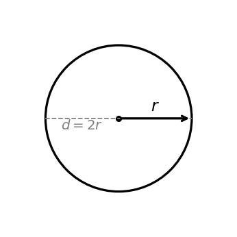
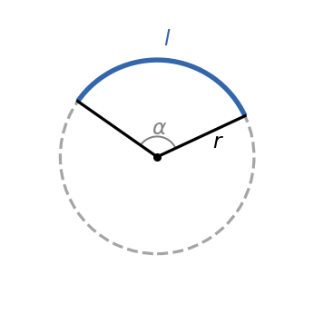
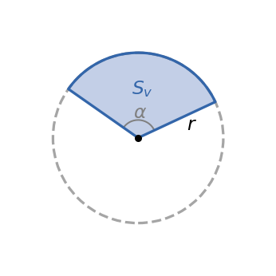
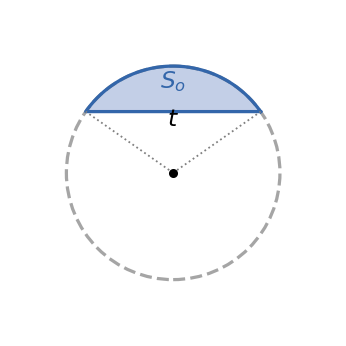

# Obvod kruhu

Obvod kružnice s polomerom $r$ je $O = 2\pi r$.

**1)**

Záhradník chce pozdĺž okraja kruhového záhonu s polomerom $r = 0{,}7\,\text{m}$ uložiť ozdobný obrubník.

1. Vypočítaj dĺžku obrubníka (t.j. obvod záhonu). Výsledok zaokrúhli na dve desatinné miesta ($\pi \approx 3{,}14$).
1. Iný záhon potrebuje obrubník dlhý $O = 5{,}65\,\text{m}$. Vyjadri polomer $r$ zo vzorca pre obvod a vypočítaj ho.
1. Ak sa polomer záhonu zdvojnásobí, koľkokrát vzrastie potrebná dĺžka obrubníka? Vysvetli vlastnými slovami.

**2)**

Koleso bicykla vykoná pri jazde na vzdialenosť $2{,}5\,\text{km}$ presne $1\,000$ otáčok.

1. Aký je obvod kolesa (v metroch)?
1. Vypočítaj polomer kolesa.
1. Cyklista chce prejsť $10\,\text{km}$. Koľko otáčok koleso vykoná? Predpokladaj rovnaký polomer.

# Obsah kruhu

Obsah kruhu s polomerom $r$ je $S = \pi r^2$.

**3)**

Kruhová záhrada má priemer $d = 14\,\text{m}$.

1. Vypočítaj obsah záhrady ($\pi \approx 3{,}14$).
1. Iná záhrada má obsah $S = 200\,\text{m}^2$. Vyjadri polomer $r$ zo vzorca $S = \pi r^2$ a vypočítaj ho.
1. Polomer prvej záhrady sa zvýši o $2\,\text{m}$. O koľko $\text{m}^2$ vzrastie jej obsah? Výsledok zapíš ako výraz v $\pi$.

**4)**

Dve kruhové ihriská majú polomery $r_1 = 5\,\text{m}$ a $r_2 = 7\,\text{m}$.

1. Vypočítaj obsah každého ihriska.
1. O koľko $\text{m}^2$ je druhé ihrisko väčšie?
1. Vypočítaj pomer $S_2 / S_1$. Všimni si, že pomer plôch sa rovná druhej mocnine pomeru polomerov. Prečo?

# Kružnicový oblúk

Dĺžka kružnicového oblúka vypočítame pomocou $l = \dfrac{2\pi r}{360\degree}
\cdot \alpha$ (pri stredovom uhle $\alpha$).

**5)**

Stierač predného skla automobilu má dĺžku $r = 45\,\text{cm}$ a pri jednom pohybe opisuje oblúk so stredovým uhlom $\alpha = 120\degree$.

1. Vypočítaj dĺžku oblúka, ktorý stierač opíše pri jednom pohybe.
1. Aký stredový uhol (v stupňoch) by musel stierač opisovať, aby dĺžka oblúka bola presne $l = 1\,\text{m}$? Vyjadri $\alpha$ zo vzorca $l = r\alpha$.

**6)**

Oblúk kružnice s polomerom $r = 20\,\text{cm}$ má dĺžku $l = 25\,\text{cm}$.

1. Vyjadri stredový uhol $\alpha$ zo vzorca a vypočítaj ho.
1. Vypočítaj, akú časť celého obvodu kružnice tvorí tento oblúk (resp. pomer $l / O$)

# Kruhový výsek

Obsah kruhového výseku so stredovým uhlom $\alpha$ a polomerom $r$ je $S_v =
\dfrac{\pi r^2}{360\degree} \cdot \alpha$

**7)**

Z kruhu s polomerom $r = 12\,\text{cm}$ je vystrihnutý výsek so stredovým uhlom $\alpha = 60\degree$.

1. Vypočítaj obvod výseku, t.j. súčet dĺžky oblúka a dvoch polomerov.
1. Aký by bol obsah výseku, keby bol stredový uhol $\alpha = 90\degree$? Porovnaj s výsledkom z bodu 1. O koľko percent je väčší?

**8)**

Kruhový výsek má obsah $S_v = 16\pi\,\text{cm}^2$ a polomer $r = 8\,\text{cm}$.

1. Vyjadri stredový uhol $\alpha$.
1. Vypočítaj dĺžku oblúka príslušného výseku.
1. Zvyšná časť kruhu (po oddelení výseku) tvorí väčší výsek. Vypočítaj jeho obsah. *Doplnkové otáyky*: (A) Aký je pomer výseku ku zvyšnej časti kruhu? (B) Aký vplyv má na tento pomer uhol $\alpha$? Vysvetli.

# Kruhový odsek

Obsah kruhového odseku (oblasť medzi tetivou\footnote{Ak priamka, ktorá precházda cez 2 body na kružnici je sečnica, tak úsečka tvorená týmito dvoma bodmi sa nazýva práve \texit{tetiva}.} a oblúkom) so stredovým
uhlom $\alpha$ je $S_o = S_v - S_\triangle$.

**9)**

V kruhu s polomerom $r = 10\,\text{cm}$ zviera tetiva so stredom kružnice uhol $\alpha = 90\degree$.

1. Vypočítaj obsah príslušného kruhového výseku. Čo znamená, že $\alpha = 90\degree$?
1. Vypočítaj obsah trojuholníka, ktorý tvoria oba polomery a tetiva.
1. Vypočítaj obsah kruhového odseku.

**10)**

V kruhu s polomerom $r = 6\,\text{cm}$ má tetiva rovnakú dĺžku ako polomer, t.j. $t = r = 6\,\text{cm}$.

1. Ukáž, že trojuholník tvorený dvoma polomermi a tetivou je rovnostranný, a urči stredový uhol $\alpha$.
1. Vypočítaj obsah odseku pod uhlom $\alpha$.

# Medzikružie

Obsah medzikružia dvoch **sústredných kružníc**\footnote{Všimni si, že obe kružnice majú ten istý stred v istom bode.} s polomermi $R > r$ je
$S_m = \pi(R^2 - r^2)$, resp. $S_m = S_{K_1} - S_{K_2}$, kde $K_1$ je kruh s polomerom $R$ a $K_2$ je kruh s polomerom $r$.

**11)**

Okolo kruhovej fontány s polomerom $r = 5\,\text{m}$ vedie chodník šírky $d = 3\,\text{m}$.

1. Urči vonkajší polomer $R$ medzikružia a vypočítaj obsah chodníka.
1. Vypočítaj šírku chodníka $d$, ak je jeho obsah $S = 99\pi\,\text{m}^2$ a vnútorný polomer $r = 10\,\text{m}$.

**12) Bonus**

Medzikružie má obsah $S_m = 75\pi\,\text{cm}^2$. Súčet polomerov oboch kružníc je $R + r = 25\,\text{cm}$.

1. Využi vzorec pre rozdiel štvorcov: $R^2 - r^2 = (R + r)(R - r)$, aby si vyjadril $R - r$. Využi poznatky zo zadania, zostav sústavu rovníc s polomermi $R,r$ a vypočítaj ich hodnoty.
1. *Skúška správnosti*: over výsledok dosadením do vzorca $S_m = \pi(R^2 - r^2)$.
